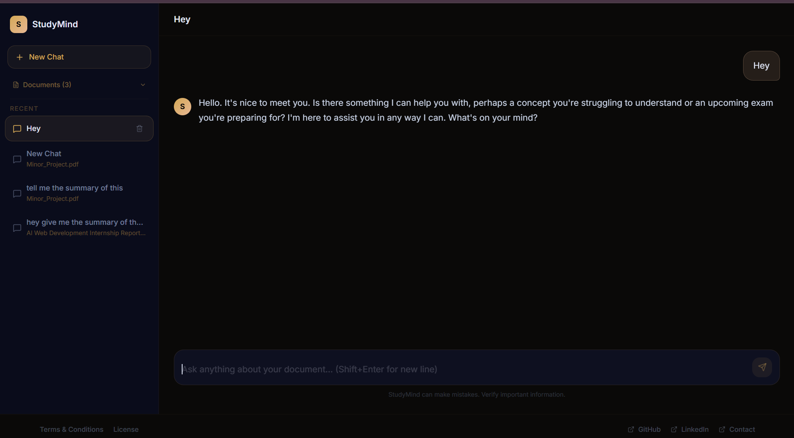
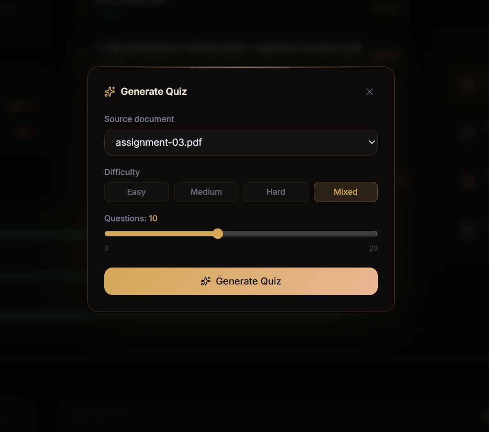
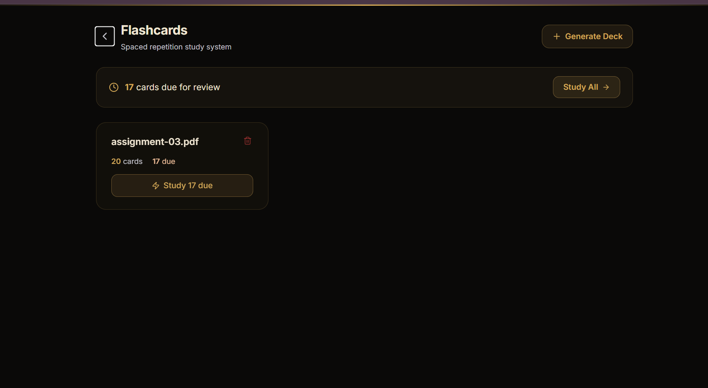

<div align="center">

<div align="center">
  

</div>

**An intelligent study companion powered by RAG, LLMs, and spaced repetition.**

Upload your PDFs. Chat with them. Get quizzed. Build a study plan. Review flashcards. All in one place.

<br/>

[](https://python.org)
[](https://fastapi.tiangolo.com)
[](https://react.dev)
[](https://mongodb.com)
[](LICENSE)

</div>

---

## What it does

StudyMind AI turns passive study materials into an active learning loop. Upload a PDF once — the rest is AI-driven.

| | Feature | Description |
|---|---|---|
| **PDF → RAG** | Upload & index | Content is chunked, embedded via HuggingFace Sentence Transformers, and stored in a per-user FAISS index |
| **Chat** | AI Q&A | Stream grounded answers from your documents via SSE with full conversation history |
| **Quiz** | Auto-MCQ | Generate multiple-choice quizzes from any document; scores tracked over time |
| **Study Plan** | Adaptive scheduling | AI builds hourly / daily / weekly plans anchored to your exam date |
| **Flashcards** | Spaced repetition | SM-2 algorithm decks generated directly from document content |
| **Dashboard** | Progress tracking | Recharts activity graphs, quiz leaderboard, streak counter, document hub |
| **Auth** | Secure sessions | JWT in-memory access tokens + httpOnly refresh cookies + silent refresh |
| **Rate limiting** | Abuse protection | SlowAPI per-endpoint limits on all sensitive routes |

---

## Screenshots

<div align="center">

| Dashboard | AI Chat |
|---|---|
|  |  |

| Quiz | Study Plan | Flashcards |
|---|---|---|
|  |  |  |

</div>

---

## Tech stack

### Backend


### Frontend


---

## Local development

### Prerequisites

- Docker Desktop — runs MongoDB + Redis
- Node.js 20+
- Python 3.14+

### 1. Clone

```bash
git clone https://github.com/abhik-kundu09/StudyMind_AI.git
cd StudyMind_AI
```

### 2. Start infrastructure

```bash
docker compose up -d
```

Starts MongoDB on `:27017` and Redis on `:6379`.

### 3. Backend

```bash
cd backend
python -m venv venv

source venv/bin/activate        # macOS / Linux
# venv\Scripts\activate         # Windows

pip install -r requirements.txt
```

Create `backend/.env` — see [Environment variables](#environment-variables) below.

```bash
# Terminal 1 — API server
uvicorn app.main:app --reload --port 8000

# Terminal 2 — Celery worker (Windows: --pool=solo)
python -m celery -A app.tasks.celery_app.celery_app worker --loglevel=info --pool=solo
```

### 4. Frontend

```bash
cd frontend
npm install
npm run dev
```

Open `http://localhost:5173`.

---

## Environment variables

### `backend/.env`

```env
# MongoDB
MONGODB_URL=mongodb://localhost:27017
DATABASE_NAME=studymind-ai

# Redis
REDIS_URL=redis://localhost:6379

# JWT
SECRET_KEY=your-secret-key-min-32-chars
ALGORITHM=HS256
ACCESS_TOKEN_EXPIRE_MINUTES=15
REFRESH_TOKEN_EXPIRE_DAYS=7

# Groq
GROQ_API_KEY=your-groq-api-key

# CORS
FRONTEND_ORIGIN=http://localhost:5173

# Set true in production (requires HTTPS)
COOKIE_SECURE=false
```

### `frontend/.env`

```env
VITE_API_URL=http://localhost:8000/api/v1
```

---

## Project structure

```
studymind-ai/
├── backend/
│   ├── app/
│   │   ├── api/v1/          # Route handlers — auth, chat, quiz, flashcards, study plan
│   │   ├── ai/              # LLM clients, embeddings, FAISS, LangChain chains
│   │   ├── core/            # Config, security, dependencies, rate limiter
│   │   ├── database/        # MongoDB connection + index setup
│   │   ├── models/          # Pydantic data models
│   │   ├── schemas/         # Request / response schemas
│   │   ├── services/        # Business logic layer
│   │   ├── tasks/           # Celery app + PDF processing task
│   │   └── main.py          # FastAPI entrypoint
│   ├── data/
│   │   └── faiss_indexes/   # Per-user FAISS index files (gitignored)
│   ├── requirements.txt
│   ├── Dockerfile
│   └── .env
├── frontend/
│   ├── src/
│   │   ├── api/             # Axios helpers per feature
│   │   ├── components/      # Shared UI + feature components
│   │   ├── hooks/           # Custom React hooks
│   │   ├── pages/           # Route-level page components
│   │   ├── store/           # Zustand stores
│   │   ├── utils/           # cn() and other utilities
│   │   ├── App.jsx          # Router + AnimatePresence
│   │   ├── main.jsx
│   │   └── index.css        # Tailwind v4 @theme tokens
│   ├── package.json
│   └── .env
├── docs/
│   ├── API.md
│   ├── DATABASE_SCHEMA.md
│   ├── DEPLOYMENT.md
│   └── screenshots/
├── docker-compose.yml
└── README.md
```

---

## Deployment

| Layer | Platform | Plan |
|---|---|---|
| Database | MongoDB Atlas | Free 512 MB shared cluster |
| Cache / Queue | Redis Cloud | Free 30 MB instance |
| Backend | Render | Free tier — builds from Dockerfile |
| Frontend | Vercel | Free — no cold starts |

Full guide: [docs/DEPLOYMENT.md](docs/DEPLOYMENT.md)

---

## API reference

Interactive Swagger UI (local): [`http://localhost:8000/docs`](http://localhost:8000/docs)

Full endpoint reference: [docs/API.md](docs/API.md)

Database schema: [docs/DATABASE_SCHEMA.md](docs/DATABASE_SCHEMA.md)

---

## Author

**Abhik Kundu** — B.Tech CS (AI/ML), KIIT University

[](https://github.com/abhik-kundu09)
[](https://www.linkedin.com/in/abhik--kundu)
[](mailto:itsabhik003@gmail.com)

---

## License

[](LICENSE)